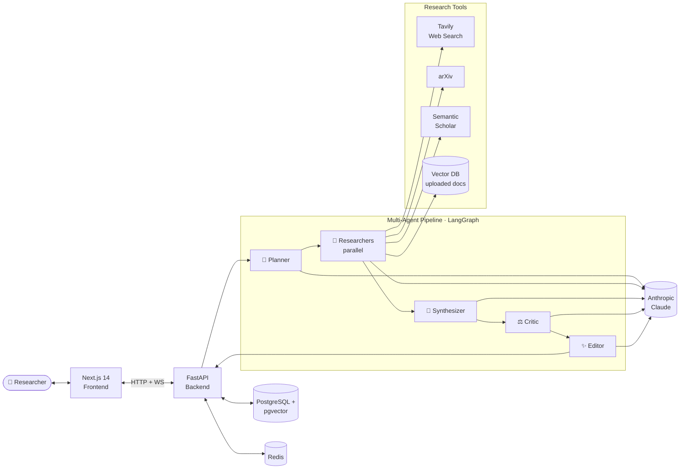
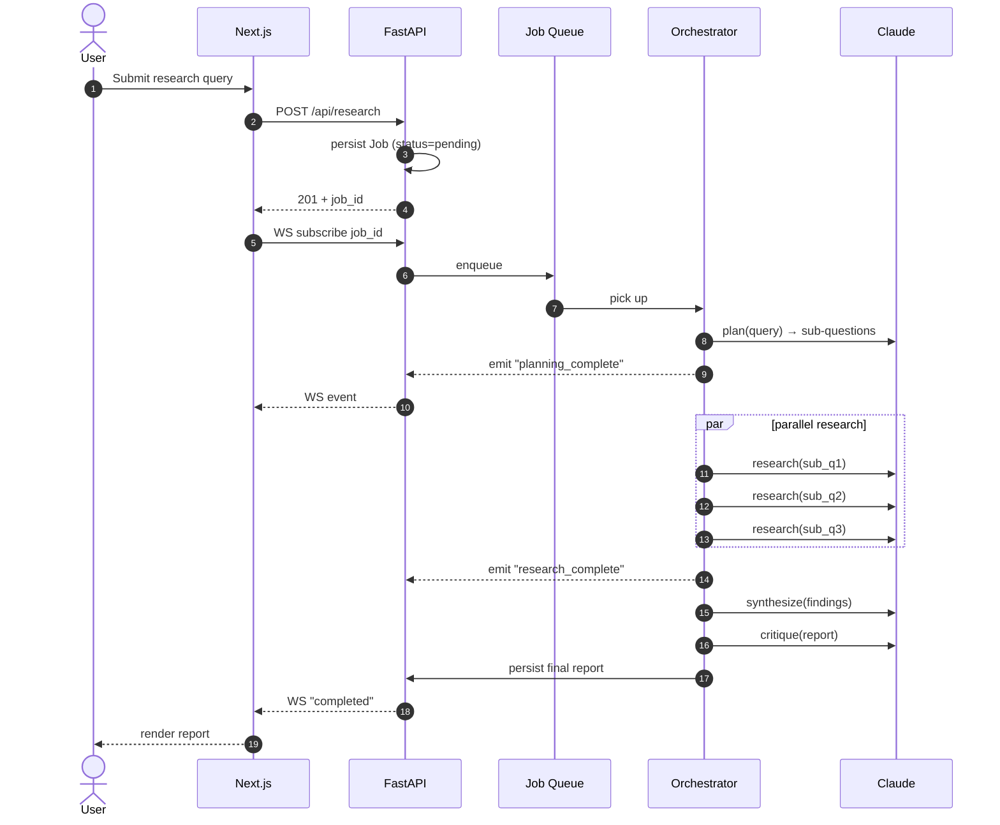

<div align="center">

# 🧠 OpenScholar

### Autonomous multi-agent research platform. Ask any question — get a fully-cited research report in minutes, written by a team of specialized AI agents.

[](https://github.com/Gnaneswar99/openscholar/actions/workflows/backend-ci.yml)
[](https://github.com/Gnaneswar99/openscholar/actions/workflows/frontend-ci.yml)
[](https://www.python.org/)
[](https://fastapi.tiangolo.com/)
[](https://nextjs.org/)
[](https://www.typescriptlang.org/)
[](./LICENSE)

[**Features**](#-features) ·
[**Architecture**](#-architecture) ·
[**Quick Start**](#-quick-start) ·
[**API**](#-api-reference) ·
[**Roadmap**](#-roadmap)

</div>

---

## 🌟 What is OpenScholar?

OpenScholar is an open-source research platform that turns a single question into a polished, evidence-backed report. Behind the scenes, a **multi-agent pipeline** built on LangGraph + Claude:

1. **Plans** — decomposes the question into parallel sub-questions.
2. **Researches** — multiple agents search the web (Tavily), academic papers (arXiv, Semantic Scholar), and your own uploaded documents simultaneously.
3. **Synthesizes** — combines findings into a structured report with inline citations.
4. **Critiques** — scores every claim for faithfulness and grounding using RAGAS.
5. **Streams** — every step is broadcast over WebSockets so you watch the agents think in real time.

It's designed to be the kind of project that hiring managers actually open and read — production-grade architecture, real tests, deployable infrastructure, and a story that maps cleanly to the JDs you'll see at Anthropic, OpenAI, Cohere, Hebbia, Harvey, Perplexity, and every AI-first startup right now.

> **Why this exists.** Most "AI agent" portfolio projects are toy notebooks. OpenScholar is built like a product: typed configs, async I/O, JWT auth, layered architecture, Docker Compose, CI/CD, evaluation metrics, observability. It's a reference implementation for what 2026 AI engineering jobs actually demand.

---

## ✨ Features

### Phase 1 — Foundation (this release)
- ✅ **Async FastAPI backend** — typed config, JWT auth, layered architecture
- ✅ **Next.js 14 frontend** — landing page, login/register, research dashboard
- ✅ **Postgres + async SQLAlchemy 2.0** — research jobs, sources, users
- ✅ **Docker Compose stack** — `docker compose up` and you have the whole platform
- ✅ **GitHub Actions CI** — lint, test, type-check, security scan
- ✅ **9 passing tests** — auth flow, research CRUD, OpenAPI contract
- ✅ **Agent skeletons** — Planner, Researcher, Synthesizer, Critic, Editor (interfaces defined)
- ✅ **Production-grade Dockerfiles** — multi-stage, non-root, healthchecks

### Coming in upcoming phases
- 🚧 **Phase 2:** Single-agent MVP — Tavily web search + Claude → cited answer
- 🚧 **Phase 3:** Full LangGraph multi-agent orchestration
- 🚧 **Phase 4:** Real-time WebSocket streaming of agent reasoning
- 🚧 **Phase 5:** RAG — upload PDFs, pgvector-backed retrieval
- 🚧 **Phase 6:** Critic agent + RAGAS evaluation + reasoning tree viz
- 🚧 **Phase 7:** Production deployment + LangSmith observability + demo video

---

## 🏗 Architecture

### System overview



### The five agents

| Agent | Job | Implementation |
|---|---|---|
| **🧭 Planner** | Decompose query → 3–7 sub-questions, pick research strategy | LLM with structured-output prompt |
| **🔎 Researcher** (×N) | For each sub-question: search → read → extract facts + sources | Tool-using agent, runs in parallel |
| **📝 Synthesizer** | Merge all findings into structured markdown report with inline citations | Long-context LLM call |
| **⚖️ Critic** | Score every claim for grounding; flag weak citations | RAGAS-style faithfulness eval |
| **✨ Editor** | Final polish: executive summary, formatting, tone | Refinement LLM call |

### Request lifecycle



### Project layout

```
openscholar/
├── backend/                          # Async FastAPI
│   ├── src/openscholar/
│   │   ├── api/                      # Routers: auth, research
│   │   ├── agents/                   # Planner, Researcher, Synthesizer, Critic, Editor
│   │   ├── core/                     # database, security, logging, exceptions
│   │   ├── models/                   # SQLAlchemy ORM (User, ResearchJob, Source)
│   │   ├── schemas/                  # Pydantic request/response types
│   │   ├── services/                 # UserService, ResearchService
│   │   ├── tools/                    # Tavily, arXiv, Semantic Scholar (Phase 2+)
│   │   ├── config.py
│   │   └── main.py
│   ├── alembic/                      # DB migrations
│   ├── tests/                        # pytest (9 passing)
│   └── Dockerfile
│
├── frontend/                         # Next.js 14 (app router) + TypeScript + Tailwind
│   ├── src/
│   │   ├── app/                      # Pages: /, /login, /register, /research
│   │   ├── components/               # UI primitives
│   │   ├── hooks/                    # Zustand auth store
│   │   ├── lib/                      # API client, utilities
│   │   └── types/                    # TypeScript interfaces
│   └── Dockerfile
│
├── .github/workflows/                # backend-ci, frontend-ci, codeql
├── docker-compose.yml                # full stack: db + backend + frontend
├── .env.example
├── LICENSE
└── README.md
```

---

## 🛠 Tech Stack

| Layer | Choice | Why this specifically |
|---|---|---|
| **Backend** | Python 3.12 · FastAPI · Uvicorn | Async, typed, auto-docs, the canonical AI-backend stack |
| **ORM** | SQLAlchemy 2.0 (async) · Alembic | Modern async patterns, prod-ready migrations |
| **Database** | PostgreSQL · pgvector (Phase 5+) | SQL + vector search in one engine |
| **Cache / Queue** | Redis (Phase 2+) · Celery | Standard background-job stack |
| **Auth** | JWT (access + refresh) · bcrypt | Stateless, scalable |
| **LLM** | Anthropic Claude (primary) · OpenAI (fallback) | Multi-provider = production-grade |
| **Agent framework** | LangGraph (Phase 3+) | The framework named in 80% of AI engineer JDs |
| **Web search** | Tavily (AI-optimized) | The standard for agentic search |
| **Academic** | arXiv API · Semantic Scholar | Broad-domain credibility |
| **Evaluation** | RAGAS · custom evals (Phase 6) | The senior-engineer differentiator |
| **Frontend** | Next.js 14 (app router) · React 18 · TypeScript 5 | Industry-standard modern React |
| **State** | TanStack Query · Zustand | Server state separated from client state |
| **UI** | Tailwind CSS · Lucide icons · react-markdown | Beautiful, fast |
| **DevOps** | Docker (multi-stage) · Compose · GitHub Actions | Reproducible, deployable, automated |
| **Tooling** | Ruff · mypy · pytest · ESLint · Prettier | Quality enforced in CI |

---

## 🚀 Quick Start

### Prerequisites

- **Python 3.11+** ([download](https://www.python.org/downloads/))
- **Node.js 20+** ([download](https://nodejs.org/))
- **Docker Desktop** ([download](https://docs.docker.com/get-docker/))
- An **Anthropic API key** ([console.anthropic.com](https://console.anthropic.com))
- A **Tavily API key** (free tier, [tavily.com](https://tavily.com)) — only needed from Phase 2

### 🐳 Option A — Docker Compose (recommended)

```bash
git clone https://github.com/Gnaneswar99/openscholar.git
cd openscholar

# Copy and fill in your secrets
cp .env.example .env
# Edit .env — at minimum set SECRET_KEY and ANTHROPIC_API_KEY

docker compose up --build
```

After ~2 minutes:
- **Frontend:** http://localhost:3000
- **Backend + API docs:** http://localhost:8000/docs
- **Postgres:** localhost:5432

### 🐍 Option B — Local development (no Docker)

**Backend:**
```bash
cd backend
python -m venv .venv && source .venv/bin/activate    # macOS/Linux
# .venv\Scripts\activate                              # Windows PowerShell
pip install -r requirements-dev.txt
cp ../.env.example ../.env                            # then edit it
uvicorn openscholar.main:app --reload --app-dir src --env-file ../.env
```
Backend live at http://localhost:8000 (`/docs` for Swagger).

**Frontend (separate terminal):**
```bash
cd frontend
npm install
npm run dev
```
Frontend live at http://localhost:3000.

### 🧪 Run the tests

```bash
cd backend
APP_ENV=test DATABASE_URL=sqlite+aiosqlite:///:memory: SECRET_KEY=test \
  PYTHONPATH=src pytest -v
# 9 passed in ~2s
```

---

## 📡 API Reference

Full interactive docs at **`/docs`** (Swagger) and **`/redoc`** when running.

### Authentication

| Method | Path | Description |
|---|---|---|
| `POST` | `/api/auth/register` | Register (first user → admin) |
| `POST` | `/api/auth/login` | Get access + refresh tokens |
| `POST` | `/api/auth/refresh` | Exchange refresh for new access token |
| `GET`  | `/api/auth/me` | Current user profile |

### Research

| Method | Path | Description |
|---|---|---|
| `POST` | `/api/research` | Create a new research job |
| `GET`  | `/api/research` | List your research jobs (paginated) |
| `GET`  | `/api/research/{id}` | Get full job detail + sources + report |
| `DELETE` | `/api/research/{id}` | Delete a job |

### Example session

```bash
# Register
curl -X POST http://localhost:8000/api/auth/register \
  -H "Content-Type: application/json" \
  -d '{"email":"you@example.com","password":"yourpassword","full_name":"You"}'

# Login → save token
TOKEN=$(curl -s -X POST http://localhost:8000/api/auth/login \
  -H "Content-Type: application/json" \
  -d '{"email":"you@example.com","password":"yourpassword"}' \
  | python -c "import sys,json; print(json.load(sys.stdin)['access_token'])")

# Create research job
curl -X POST http://localhost:8000/api/research \
  -H "Authorization: Bearer $TOKEN" \
  -H "Content-Type: application/json" \
  -d '{"query":"What are the latest breakthroughs in fusion energy in 2026?"}'
```

---

## 🔧 Configuration

All configuration via environment variables. See [`.env.example`](./.env.example).

Key variables:

| Variable | Default | Notes |
|---|---|---|
| `APP_ENV` | `development` | `development` · `staging` · `production` · `test` |
| `SECRET_KEY` | _(required)_ | JWT signing key. Generate: `python -c "import secrets; print(secrets.token_urlsafe(48))"` |
| `DATABASE_URL` | SQLite | Async SQLAlchemy URL. Use Postgres in prod |
| `ANTHROPIC_API_KEY` | _(required)_ | Claude API key |
| `ANTHROPIC_MODEL` | `claude-sonnet-4-5` | LLM model id |
| `TAVILY_API_KEY` | _(Phase 2+)_ | For web search agent |
| `CORS_ORIGINS` | localhost | Comma-separated allowed frontend origins |

---

## 🗺 Roadmap

### ✅ Phase 1 — Foundation (this release)
Full-stack scaffolding, auth, CRUD APIs, Docker Compose, CI. **Runs out of the box.**

### 🚧 Phase 2 — Single-agent MVP
- Tavily web search tool
- One Researcher agent: query → search → Claude extracts facts + cites sources
- Job runs as a FastAPI background task
- Frontend shows live status updates via polling

### 🚧 Phase 3 — Multi-agent orchestration
- LangGraph state machine with all 5 agents
- Parallel researchers (3–5 in parallel via `asyncio.gather`)
- Cost & token tracking per agent step
- Celery + Redis for proper background job processing

### 🚧 Phase 4 — Real-time streaming
- WebSocket endpoint per job
- Stream every agent's reasoning to the frontend
- Live-rendering markdown editor watching the report build

### 🚧 Phase 5 — RAG (upload your own sources)
- PDF / URL ingestion
- pgvector embeddings (Anthropic / OpenAI / sentence-transformers)
- Researcher agents can search uploaded corpus alongside the web

### 🚧 Phase 6 — Evaluation + observability
- Critic agent with RAGAS metrics (faithfulness, answer relevance, context precision)
- Reasoning-tree visualization
- LangSmith tracing on every agent call
- Per-user usage dashboard

### 🚧 Phase 7 — Production deployment
- Live demo at openscholar.dev (or your domain)
- Railway / Fly.io deployment guides
- Demo video on the README
- Performance optimization + caching

---

## 🤝 Contributing

PRs, issues, and feature requests are welcome.

1. Fork → branch (`feat/...`) → commit → push → PR
2. Use [Conventional Commits](https://www.conventionalcommits.org/): `feat: ...`, `fix: ...`, `docs: ...`
3. CI must be green (lint, types, tests)

Code-style rules:
- Python: `ruff check src tests` must pass
- TypeScript: `tsc -b` and `next lint` must pass
- Type hints required on all Python function signatures

---

## 🔒 Security

If you find a vulnerability, please **do not open a public issue**. Use [Private Vulnerability Reporting](https://docs.github.com/en/code-security/security-advisories) or email the maintainer.

Built-in protections:
- 🔐 Bcrypt password hashing
- 🎟 JWT with separate access / refresh tokens
- 🛡 CORS allowlist, configurable per environment
- 🔍 CodeQL security scanning in CI

---

## 📜 License

MIT — see [LICENSE](./LICENSE).

---

## 🙏 Acknowledgments

- [Anthropic](https://www.anthropic.com/) — Claude, the LLM that powers the agents
- [LangChain / LangGraph](https://langchain.com/) — agent orchestration
- [Tavily](https://tavily.com/) — AI-optimized web search
- [FastAPI](https://fastapi.tiangolo.com/) — Sebastián Ramírez and contributors
- [Next.js](https://nextjs.org/) — Vercel
- The wider Python and TypeScript open-source ecosystem

---

## 👤 Author

**Gnaneswar**
GitHub: [@Gnaneswar99](https://github.com/Gnaneswar99)

If this project helped you or inspired your own, please ⭐️ the repo, it really helps.

---

<div align="center">

Built with care. ·
[Report a bug](https://github.com/Gnaneswar99/openscholar/issues) ·
[Request a feature](https://github.com/Gnaneswar99/openscholar/issues)

</div>
